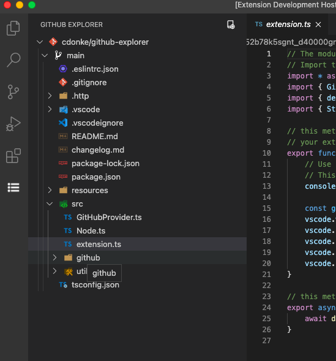
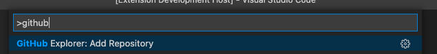

# github-explorer

[](https://marketplace.visualstudio.com/items?itemName=cdonke.github-explorer)
[](https://marketplace.visualstudio.com/items?itemName=cdonke.github-explorer)
[](https://marketplace.visualstudio.com/items?itemName=cdonke.github-explorer)

[](https://david-dm.org/cdonke/github-explorer)
[](https://david-dm.org/cdonke/github-explorer?type=dev)

---

Explore GitHub Repositories from [Visual Studio Code](https://code.visualstudio.com/) without cloning it.



Just click the `Add Repository` button, or call the command `GitHub Explorer: Add Repository`



## Installation

To install the extension just execute the following command:

```sh
code --install-extension cdonke.github-explorer
```

## License

The source code is licensed under the [MIT](LICENSE) license.

## Change log

You can checkout all our changes in our [change log](https://github.com/cdonke/github-explorer/blob/main/CHANGELOG.md).

**Enjoy!**